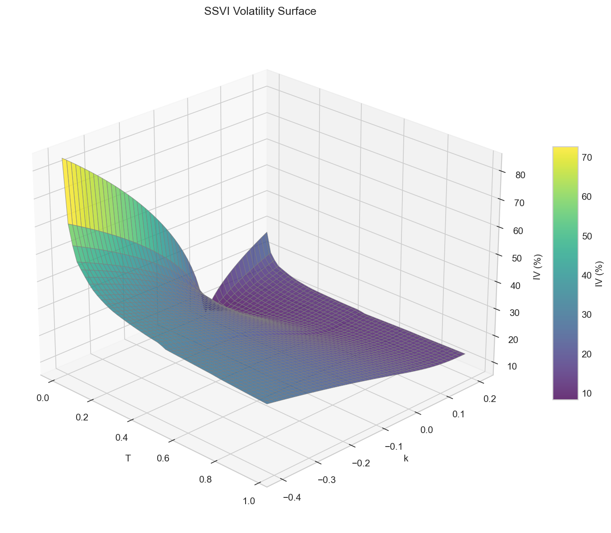

# svi-ssvi-volatility-surface

Pipeline for constructing equity index volatility surfaces from market option prices.

Fetches live SPY options data, extracts implied volatilities via Black's model, and calibrates both per-expiry SVI and joint SSVI parameterizations. The mathematical derivations are in the accompanying note.

## Files

- `data_pipeline.py`: Fetches option chains, extracts forwards via put-call parity, computes IVs
- `svi_calibration.py`: Per-expiry SVI fits with butterfly arbitrage check
- `ssvi_calibration.py`: Joint surface fit with power-law φ(θ)
- `visualization.py`: Generates diagnostic plots from calibration outputs

- `volatility_surface_note.pdf`: Mathematical background and explanation of the implementation

## References

- Gatheral & Jacquier (2014). *Arbitrage-free SVI volatility surfaces*. Quantitative Finance.
